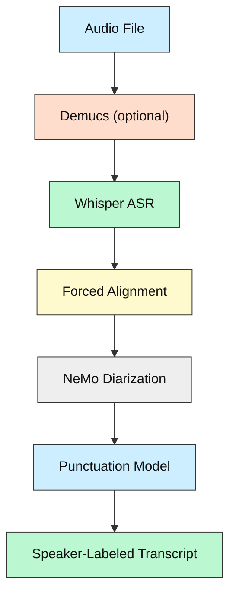
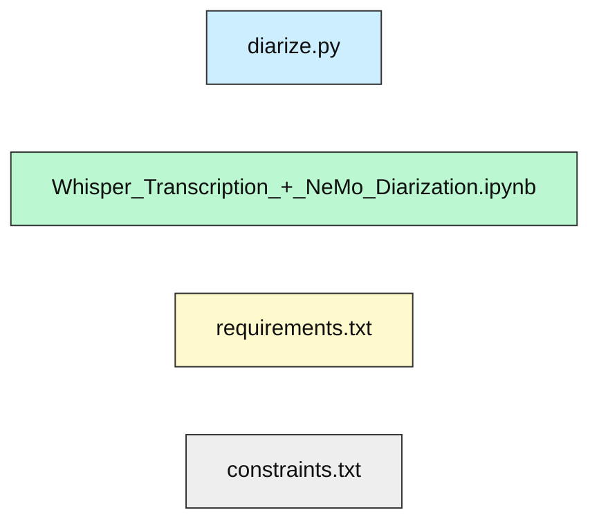
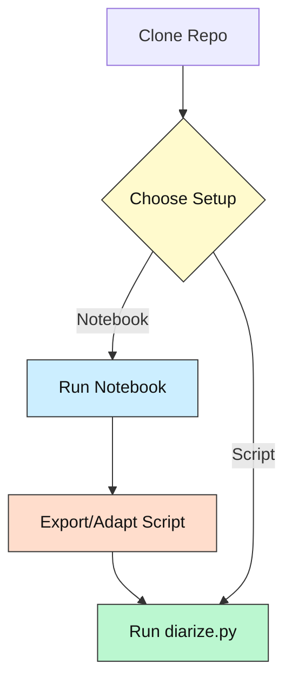

## Speaker Diarization with Whisper & NeMo – CluelessCoder Edition

  

[](https://github.com/MahmoudAshraf97/whisper-diarization/actions)

[](LICENSE)


[](https://colab.research.google.com/github/MahmoudAshraf97/whisper-diarization/blob/main/Whisper_Transcription_%2B_NeMo_Diarization.ipynb)

  

---

  

## 1· What & Why

  

This project combines OpenAI Whisper ASR with NeMo diarization to label speakers in audio. **Before following the install instructions below, it is highly advisable to first work with [`Whisper_Transcription_+_NeMo_Diarization.ipynb`](Whisper_Transcription_+_NeMo_Diarization.ipynb) in Colab or locally. 

If you work locally be aware that there are different requirements for GPU `requirements.txt` and iGPU/CPU workloads `requirements-no-torch.txt`.**

**For your first run drop your mp3 audio into the root folder and work through the Jupyter notebook which is setup to look for audio in the root folder.**

  

> **Why?** The notebook lets you experiment interactively, helps you resolve hardware issues (e.g., CUDA, GPU/iGPU/CPU, RAM), and ensures you can build a working script before running the full pipeline. Once you have a working notebook, you can convert it into a script for on-demand use.

  

The install steps in the original [README.md](README.md) are correct, but the notebook-first approach will save you time and frustration, especially if you’re new to ML or have a non-standard setup.

  

---

  

## 2· Tech‑Stack Overview

  

| Layer         | Tech                                      |

| -------------| ------------------------------------------ |

| **Language** | Python 3.10+                               |

| **ASR**      | OpenAI Whisper, Faster-Whisper             |

| **Diarization** | NVIDIA NeMo, TitaNet, MarbleNet         |

| **Separation** | Demucs (optional, for music removal)      |

| **Alignment** | ctc-forced-aligner                        |

| **Punctuation** | DeepMultilingualPunctuation              |

| **Notebook** | Jupyter/Colab                              |

  

---

  

## 3· Key Features

  

• Speaker-labeled transcription from audio

• Handles music/speech separation (optional)

• Forced alignment for accurate timestamps

• Punctuation restoration for readable output

• Beginner-friendly notebook for rapid prototyping

  

---

  

## 4· System Overview Diagram

  



  

---

  

## 5· Folder / File Guide

  

```text

📂 repo-root

 ├─ diarize.py                # Main script (after notebook)

 ├─ Whisper_Transcription_+_NeMo_Diarization.ipynb  # Recommended starting point

 ├─ requirements.txt          # Python dependencies

 ├─ constraints.txt           # Dependency constraints

 ├─ README.md                 # Original instructions

 ├─ .gitignore

```

  



  

---

  

## 6· Prerequisites & Accounts

  

| Need this         | Why                | Link                                  |

| ---------------- | ------------------ | ------------------------------------- |

| Python 3.10+      | core runtime       | https://python.org                    |

| FFMPEG, Cython    | audio processing   | see install steps below               |

| Jupyter/Colab     | run notebook       | https://colab.research.google.com     |

| CUDA Toolkit      | GPU acceleration   | https://developer.nvidia.com/cuda-downloads |

  

---

  

## 7· Setup Options (Recommended: Notebook First)

  

### A. Notebook (Best for Beginners)

  

1. Open [`Whisper_Transcription_+_NeMo_Diarization.ipynb`](Whisper_Transcription_+_NeMo_Diarization.ipynb) in Colab or Jupyter.

2. Run cells top-to-bottom, following prompts for dependencies.

3. Tweak parameters (audio file, model, device, etc) as needed.

4. Once working, export as script or adapt to `diarize.py`.

  

### B. Script (After Notebook Success)

  

Follow the original [README.md](README.md) install steps:

  

```bash

pip install cython

sudo apt install ffmpeg

pip install -c constraints.txt -r requirements.txt

python diarize.py -a AUDIO_FILE_NAME

```

  

---

  

## 8· Setup Flowchart

  



  

---

  

## 9· Run / Test

  

```bash

# Run notebook interactively

jupyter notebook Whisper_Transcription_+_NeMo_Diarization.ipynb

  

# Or run script after setup

python diarize.py -a AUDIO_FILE_NAME

  

# Run all unit tests (if available)

pytest -q

```

  

---

  

## 10· Configuration & API Keys 🔑

  

- No API keys required for local use.

- For Colab, ensure you have access to a GPU (Runtime > Change runtime type > GPU).

- If using cloud APIs, add keys to `.env` (see original README).

  

> ⚠️ Do **not** commit `.env` files. Use repository secrets for Codespaces or CI.

  

---

  

## 11· Troubleshooting / FAQ

  

| Symptom                 | Cause              | Fix                                   |

| ----------------------- | ------------------ | ------------------------------------- |

| `ModuleNotFoundError`   | venv not activated | `source .venv/bin/activate`           |

| VS Code “cannot attach” | Docker daemon off  | Start Docker Desktop / Podman         |

| CUDA not found          | No GPU/driver      | Use CPU or check Colab runtime        |

  

---

  

## 12· Status & Roadmap

  

✅ Whisper + NeMo pipeline

✅ Notebook-first workflow

⏳ CLI improvements

🔜 Overlapping speaker support

⚠️ Known: Hardware/driver issues may require notebook debugging

  

---

  

## 13· How AI Helped

  

ChatGPT and Copilot assisted with code, docs, and troubleshooting steps.

  

---

  

## 14· License

  

MIT – see [LICENSE](LICENSE).

  

---

  

## 15· Community

  

• Open an issue for questions/ideas

• PRs welcome – even docs or tests!

• New to coding? Tag your issue with **`beginner‑help`** and we’ll mentor you.

  

---

  

*Happy hacking – may your tokens be ever cheaper!* 🎉